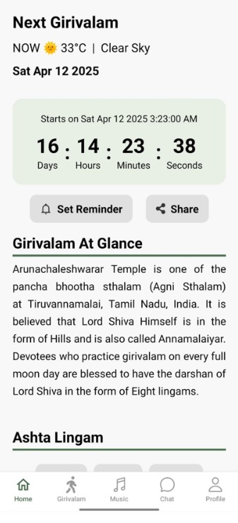
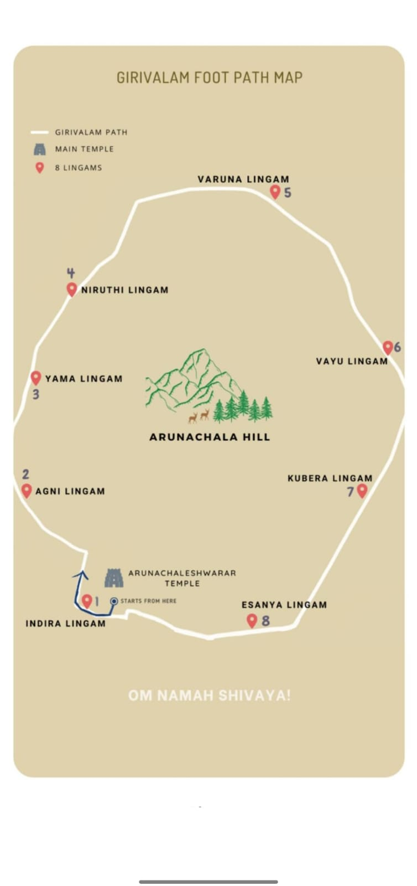
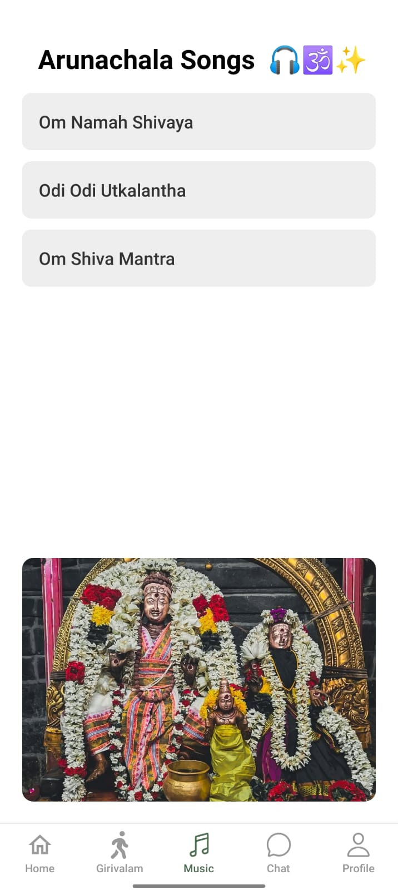
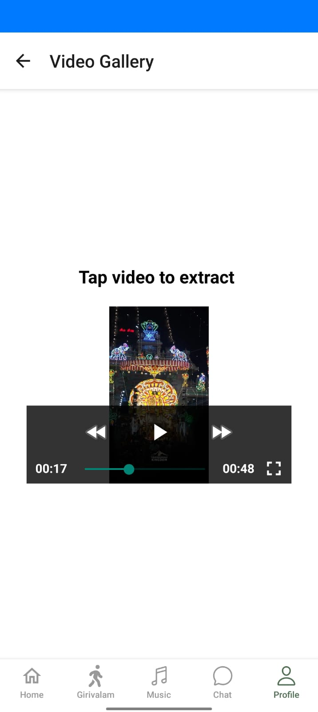
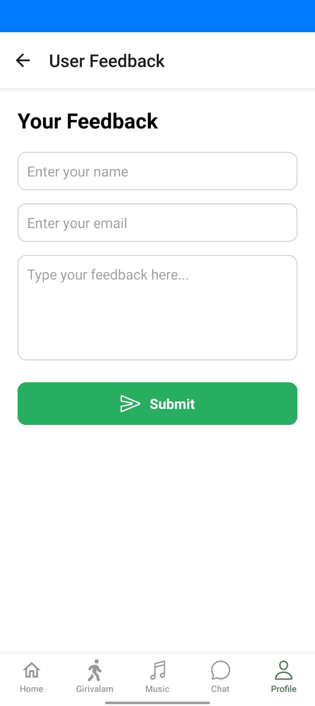

# 🕉️ Girivalam Mobile App – Final Year Project

A full-stack mobile application developed as a **Final Year MCA Project**, designed to assist devotees and tourists during **Tiruvannamalai Girivalam**. The app provides spiritual guidance, real-time information, and secure user access using Firebase Authentication.

---

## 📱 Project Overview

The **Girivalam Mobile App** enhances the Girivalam experience by offering:
- Secure user authentication
- Girivalam route and lingam information
- Festival and Full Moon day updates
- Devotional content and smart assistance

The project follows a **client–server architecture**, with **React Native** as the frontend, **Node.js** as the backend, and **Firebase** for authentication services.

---

## 🛠️ Tech Stack

### Frontend (Mobile Application)
- React Native
- JavaScript
- Expo
- Axios

### Backend (Server)
- Node.js
- Express.js
- REST API

### Authentication & Cloud Services
- Firebase Authentication
  - Email & Password Login
  - Secure User Session Management

### Tools & Platforms
- Git & GitHub
- VS Code
- Postman
- Firebase Console

---

## ✨ Key Features

- 🔐 Secure user authentication using Firebase
- 📍 Girivalam route and Ashta Lingam information
- 🗓️ Festival and Full Moon reminder & notifications
- 🎶 Devotional songs and content
- 📡 REST API-based backend integration
- 📱 Cross-platform mobile support (Android)

---

## 🧩 Project Structure

Girivalam-mobile-app-final-year-project/
│
├── backend/
│ ├── package.json
│ ├── server.js
│ └── API files
│
├── frontend/
│ └── girivalam-frontend/
│ ├── screens/
│ ├── components/
│ ├── assets/
│ └── App.js
│
└── .gitignore


---

## 🚀 How to Run the Project Locally

### Backend Setup
```bash
cd backend
npm install
node server.js

### Frontend Setup
cd frontend/girivalam-frontend
npm install
npm start

🎓 Academic Details

Project Type: Final Year MCA Project

Domain: Mobile Application Development

Architecture: Client–Server Model

Institution: Adhiyamaan College Of Engineering. 

👨‍💻 Developer

Vasanth Anbu
Frontend & Mobile App Developer
React Native | Node.js | Python | AI Enthusiast

🔗 GitHub: https://github.com/vasanth-anbu16

🔗 LinkedIn: www.linkedin.com/in/vasanth-anbu-14ab33265

⭐ Acknowledgements

Faculty & mentors

Open-source community

GitHub & React Native ecosystem


## 📸 Screenshots

### Home Screen


### Girivalam Map


### Girivalam Footpath


### Full Moon Dates


### Events


### AI Chat Assistant


### Music Section


### Video Gallery


### Feedback Screen


### Profile Screen

